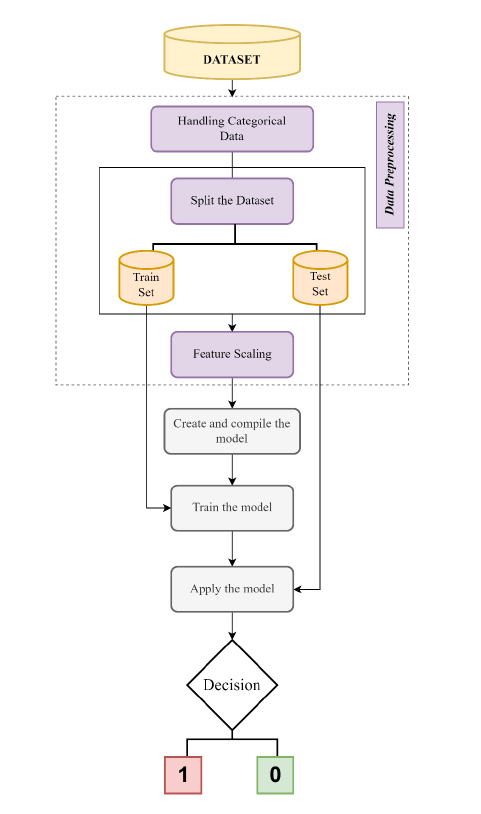
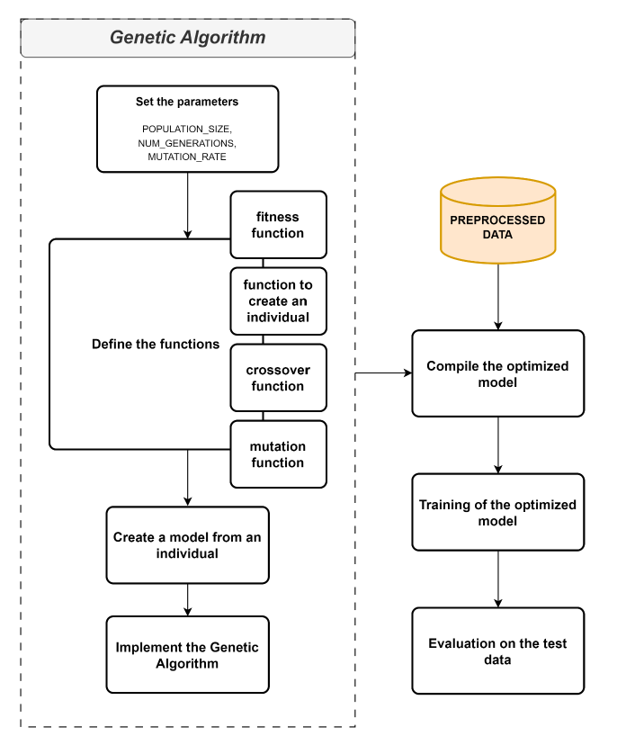
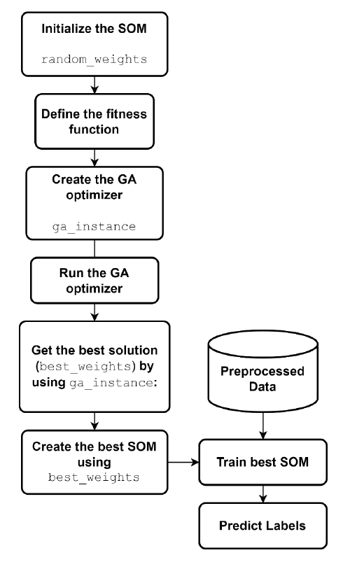
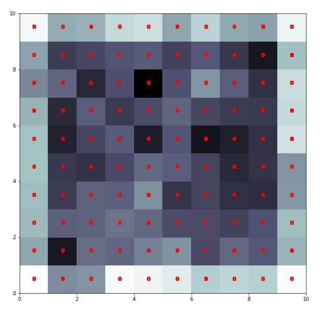

# 🧠 GA-Optimized Neural Networks for Customer Churn Prediction

Master's thesis project — Otto-von-Guericke-Universität Magdeburg (2023)

This project investigates the use of **Genetic Algorithms (GA)** to automatically optimize
the architecture of two types of Artificial Neural Networks for predicting customer churn.
Rather than manually tuning hyperparameters, the models self-optimize through evolutionary
selection — adjusting their own structure to improve predictive performance.

---

## 📌 Problem Statement

Customer churn prediction is a critical task in marketing and CRM. Identifying customers
likely to leave allows organizations to act proactively. The challenge lies not just in
building a model, but in finding the optimal neural network structure for the task —
a process typically done manually and expensively.

This project explores whether a **Genetic Algorithm can automate that optimization**,
producing better-performing models without manual hyperparameter tuning.

---

## 🏗️ Architecture & Workflows

**System Overview**



**GA-FNN Workflow**



**GA-SOM Workflow**



---

## 📂 Dataset

**Source:** [Churn Modelling Dataset — Kaggle](https://www.kaggle.com/code/mathchi/churn-problem-for-bank-customer/input)

| Property | Details |
|---|---|
| Records | 10,000 bank customers |
| Features | 10 input features (credit score, geography, gender, age, tenure, balance, etc.) |
| Target | `Exited` — binary (1 = churned, 0 = retained) |

---

## 🔬 Models

Two neural network types were optimized using Genetic Algorithms:

### 1. GA-FNN — Feedforward Neural Network (`ann_opt_GA.ipynb`)
- GA implemented **from scratch** (custom crossover, mutation, tournament selection)
- GA optimizes the number of hidden layers and neurons per layer
- Fitness function: test set accuracy after training with Adam optimizer
- Architecture: variable hidden layers with ReLU activation + Dropout (0.2) + Sigmoid output

### 2. GA-SOM — Self-Organizing Map (`som_2.ipynb`)
- GA implemented using the **PyGAD library**
- GA optimizes the SOM weight matrix directly
- SOM trained with MiniSom; predictions based on winning neuron mapping
- Provides interpretability through cluster visualization of customer segments

---

## 📊 Results

| Metric | GA-FNN | GA-SOM |
|---|---|---|
| Accuracy | **86%** | 73% |
| Sensitivity | 45% | **80%** |
| Precision | 78% | **88%** |
| Recall | 11% | **96%** |
| F1 Score | 19% | **92%** |

**Key finding:** The GA-FNN achieved higher overall accuracy, but the GA-SOM significantly
outperformed on sensitivity, recall, and F1 score — meaning it was substantially better at
actually *identifying* churning customers, which is the primary business objective.

The relatively low F1 score of GA-FNN (0.19) reflects a class imbalance challenge:
high accuracy on the majority class (retained customers) masked poor performance on
the minority class (churners). The GA-SOM proved more robust to this imbalance.

### GA-SOM Cluster Visualization



*U-matrix visualization of the trained SOM. Darker cells indicate cluster boundaries.
Red labels show predicted churn classes mapped to each neuron, providing interpretability
into underlying customer segmentation patterns.*

---

## 🛠️ Technologies

| Category | Tools |
|---|---|
| Language | Python |
| Neural Networks | TensorFlow, Keras, MiniSom |
| Genetic Algorithm | Custom implementation (GA-FNN), PyGAD (GA-SOM) |
| Data Processing | Pandas, NumPy, Scikit-learn |
| Evaluation | Confusion matrix, ROC curve, Precision-Recall curve, AUC |
| Visualization | Matplotlib |

---

## ▶️ How to Run

1. Clone the repository:
   ```
   git clone https://github.com/jabiyeva/customer-churn-ga-optimization
   ```

2. Install dependencies:
   ```
   pip install tensorflow keras pygad minisom scikit-learn pandas numpy matplotlib
   ```

3. Download the dataset from [Kaggle](https://www.kaggle.com/code/mathchi/churn-problem-for-bank-customer/input)
   and place `Churn_Modelling.csv` in the project root.

4. Run the notebooks in order:
   - `notebooks/ann_opt_GA.ipynb` — GA-optimized Feedforward Neural Network
   - `notebooks/som_2.ipynb` — GA-optimized Self-Organizing Map

---

## 📁 Repository Structure

```
churn-prediction-ga-optimization/
│
├── notebooks/
│   ├── ann_opt_GA.ipynb
│   └── som_2.ipynb
│
├── images/
│   ├── architecture_overview.png
│   ├── workflow_ga_fnn.png
│   ├── workflow_ga_som.png
│   └── som_visualization.png
│
├── Churn_Modelling.csv
└── README.md
```

---

## 📝 Notes

This code was written as part of a Master's thesis at Otto-von-Guericke-Universität
Magdeburg (completed 2023) and cleaned up for public sharing in 2026. The thesis applied
Design Science Research Methodology (DSRM) and included a full literature review on
neural network optimization techniques and hyperparameter tuning approaches.
